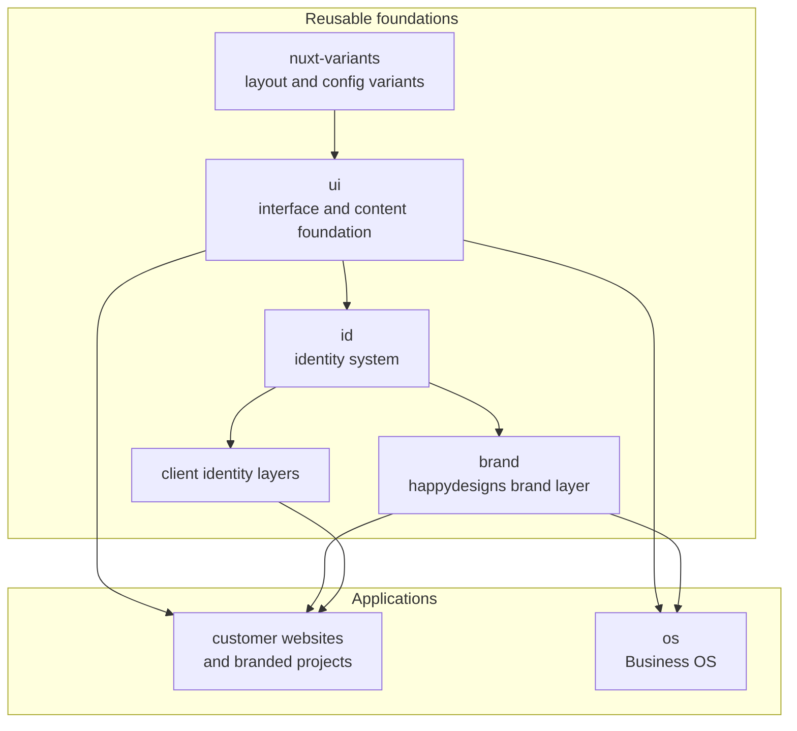

happydesigns builds customer websites, branded client projects, and apps such as Business OS on shared foundations. The goal is to solve shared interface, identity, content, and setup problems once, then reuse those decisions across many products and projects.

This page gives you the ecosystem map. Start here to see what happydesigns builds, then use [Work placement](/en/start/work-placement) to decide where new work belongs and [Source of truth](/en/start/source-of-truth) to decide which source to trust.

## What happydesigns builds

At the highest level, the ecosystem has three kinds of output:

| Area | Role | Examples |
| --- | --- | --- |
| Applications | The websites, branded projects, and apps people use. | Customer sites, branded projects, `os`. |
| Reusable foundations | Shared packages, layers, and modules that make applications consistent. | `ui`, `id`, `brand`, `nuxt-variants`. |
| Documentation | Docs for different readers and levels of detail. | Product docs, `docs`, `help`. |

Applications are the visible output. Reusable foundations carry repeated interface, identity, content, theme, and setup decisions so applications do not solve the same problems again. The documentation split keeps ecosystem strategy, product implementation, and customer guidance in the right place.

## Build map

Read this map from top to bottom. Reusable foundations feed applications; product docs, `docs`, and `help` are not drawn as dependencies because they explain the system rather than build it.

