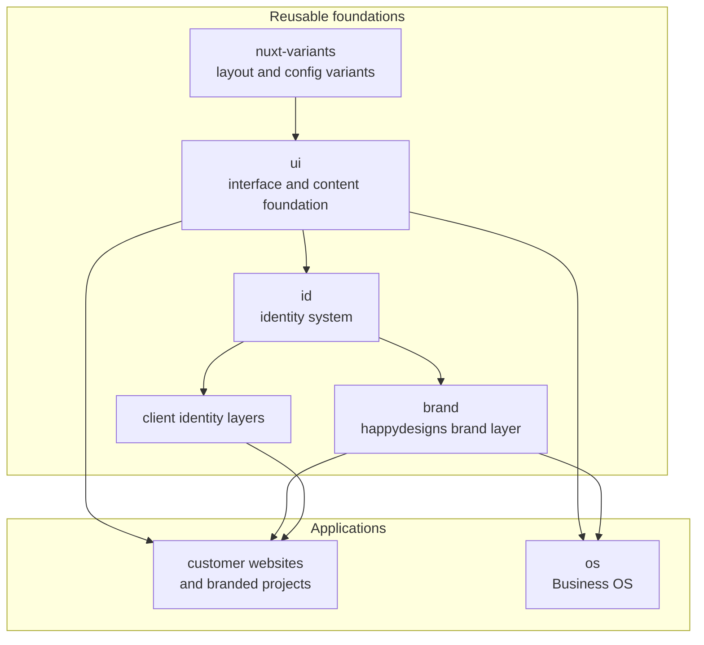

happydesigns builds customer websites, branded client projects, and apps such as Business OS on shared foundations. The goal is to solve platform problems once, then reuse those decisions across many products and projects.

This page is the first map of the ecosystem. It shows what happydesigns builds, which foundations the work builds on, and which documentation explains each part.

## What happydesigns builds

The ecosystem has three main kinds of work:

| Area | Role | Examples |
| --- | --- | --- |
| Applications | Customer-facing websites, branded customer projects, and happydesigns apps people use. | Customer sites, product shells, `os`. |
| Reusable foundations | Shared packages, layers, and modules that keep applications consistent. | `ui`, `id`, `brand`, `nuxt-variants`. |
| Documentation | Docs separated by audience and scope. | Product docs, `docs`, `help`. |

Applications are the visible output. Reusable foundations carry repeated interface, identity, content, theme, and project setup decisions. Documentation explains each part at the right level.

## Build map

The map focuses on how applications build on reusable foundations. Documentation follows the split from the table above: product docs explain implementation detail, `docs` explains ecosystem architecture, and `help` explains customer workflows.

## How to use this overview

Use the [product map](/en/products/product-map) for exact product keys, package names, repositories, and documentation links. Use [Where work belongs](/en/start/where-work-belongs) when deciding where a change should be made. Use [Source of truth](/en/start/source-of-truth) when docs, code, package metadata, and planning notes disagree.
