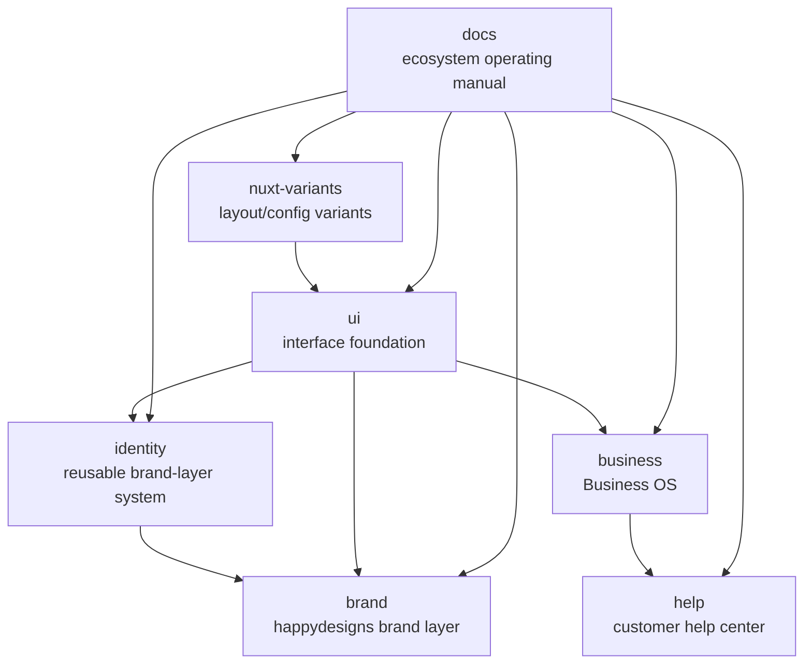

The ecosystem has one shared strategy layer and several product-specific implementation layers.

## Ecosystem diagram

Read the diagram from `docs` outward. The docs site sets shared operating rules, while product repositories own implementation. `ui` provides the interface foundation, identity and brand layers apply visual expression, Business OS owns operational workflows, and `help` is the customer-facing docs site.

## Product detail

Use the diagram for relationships between products. Use the [product map](/en/products/product-map) for the canonical product list, package identities, and product documentation boundaries.

## Boundary

The docs site explains how the pieces fit together. It does not absorb implementation guides from `ui`, `identity`, `business`, or `nuxt-variants`.
