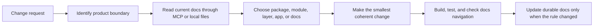

The happydesigns ecosystem is organized around durable reusable products, not one-off project code. Each product should have a clear owner, a stable boundary, and a small set of integration points.

## Purpose

The operating model keeps humans and agents aligned. A reader should be able to inspect a task, identify the product boundary, choose the right Nuxt or TypeScript layer, and avoid moving behavior into the wrong place.

## Decision rule

Use the lowest-level runtime that preserves product quality.

```txt
plain TypeScript for deterministic logic
Nuxt modules for installable behavior
Nuxt layers for UI, branding, pages, layouts, and app config
Nuxt apps for concrete user experience
Nitro for runtime boundaries, APIs, jobs, and deployment bindings
```

## Operating loop



## Good output

A good change should leave the ecosystem easier to reason about. It should make ownership clearer, reduce duplicated behavior, and keep brand expression, product logic, runtime access, and customer instructions separate.

## Read next

- [System architecture](/en/architecture)
- [Where code belongs](/en/architecture/where-code-belongs)
- [Agent workflow](/en/ai/agent-workflow)
