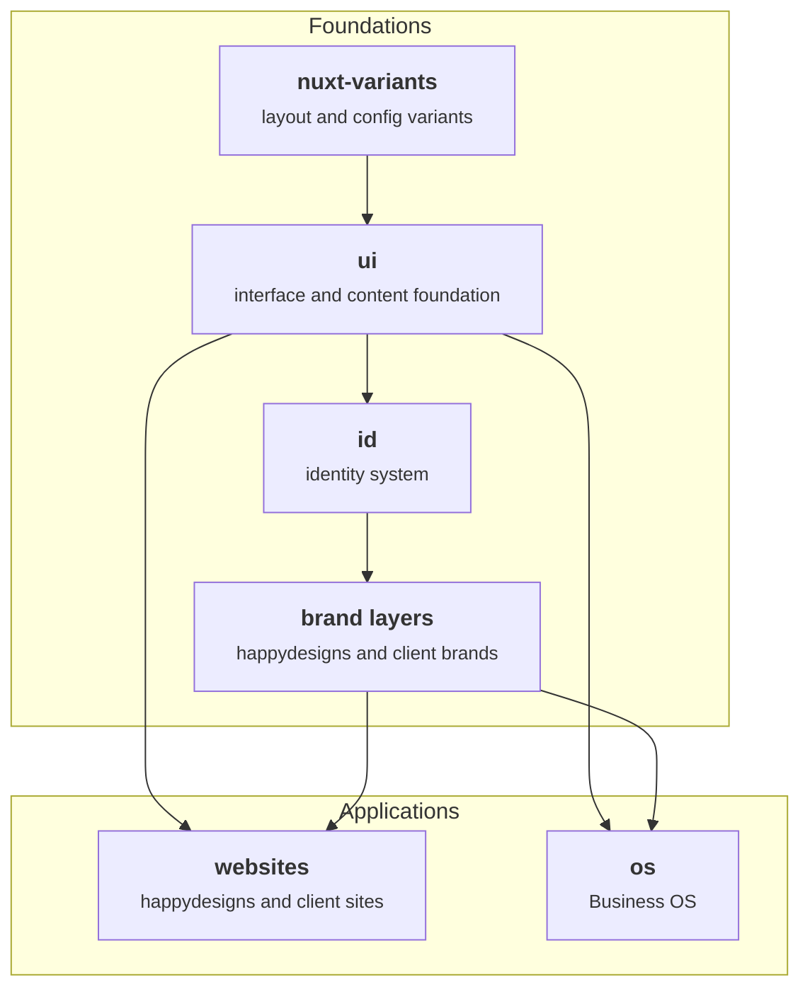

The product map explains what each happydesigns product owns and where to find its docs, repository, or package. Use this page when deciding whether a topic belongs in the ecosystem operating manual or in a dedicated product documentation site.

This site explains ecosystem roles. Product docs, repositories, and packages are the entry points for product implementation.

## Product relationships

Read this map from top to bottom. The two shaded groups are different layers: foundations are reused by applications. Documentation products are listed in the table, but not drawn as dependencies because they explain the system rather than build it.

## Products

| Product | Role | Links |
| --- | --- | --- |
| [`ui`](/products/ui) | Interface and content foundation. | [Docs](https://ui.happydesigns.de), [GitHub](https://github.com/happydesigns/ui), [npmx](https://npmx.dev/package/@happydesigns/ui) |
| [`id`](/products/id) | Identity product for reusable identity and brand-layer systems. | [Docs](https://id.happydesigns.de), [GitHub](https://github.com/happydesigns/id), [npmx](https://npmx.dev/package/@happydesigns/id) |
| [`brand`](/products/brand) | happydesigns-specific brand layer. | [Docs](https://brand.happydesigns.de), [GitHub](https://github.com/happydesigns/brand), [npmx](https://npmx.dev/package/@happydesigns/brand) |
| [`os`](/products/os) | Business OS product and workflow system. | [Docs](https://os.happydesigns.de), [GitHub](https://github.com/happydesigns/os), [npmx](https://npmx.dev/package/@happydesigns/os) |
| [`nuxt-variants`](/products/nuxt-variants) | Typed layout and content variant module. | [Docs](https://nuxt-variants.happydesigns.de), [GitHub](https://github.com/happydesigns/nuxt-variants), [npmx](https://npmx.dev/package/@happydesigns/nuxt-variants) |
| [`docs`](/products/docs) | Ecosystem operating manual, MCP, LLM, and skills source. | [Docs](https://docs.happydesigns.de), [GitHub](https://github.com/happydesigns/docs) |
| [`help`](/products/help) | Customer-facing website guidance. | [Docs](https://help.happydesigns.de), [GitHub](https://github.com/happydesigns/help) |
