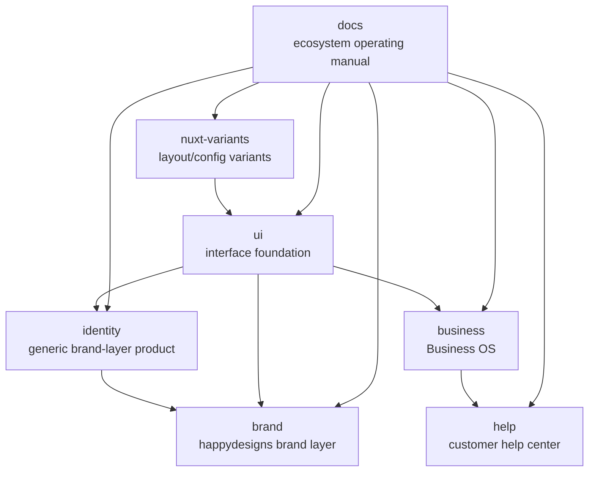

The ecosystem has one shared strategy layer and several product-specific implementation layers.

## Ecosystem diagram

Read the diagram from `docs` outward. The docs site sets shared operating rules, while product repositories own implementation. `ui` provides the interface foundation, identity and brand layers apply expression, Business OS owns operational workflows, and `help` is the customer-facing documentation surface.

## Product roles

| Area | Product | Role |
| --- | --- | --- |
| Interface | `happydesigns/ui` | Reusable Nuxt layer, components, content conventions, and app config foundation. |
| Identity | `happydesigns/identity` | Generic system for creating brand and client identity layers. |
| Brand | `happydesigns/brand` | Concrete happydesigns brand implementation. |
| Operations | `happydesigns/business` | Business OS for workflows, knowledge, tasks, agents, records, APIs, webhooks, and MCP. |
| Variants | `happydesigns/nuxt-variants` | Typed variant registry for shared layouts and content schema composition. |
| Docs | `happydesigns/docs` | This operating manual, MCP source, LLM source, and skill publisher. |
| Help | `happydesigns/help` | Customer-facing help center for non-technical website users. |

## Boundary

The docs site explains how the pieces fit together. It does not absorb implementation guides from `ui`, `identity`, `business`, or `nuxt-variants`.
