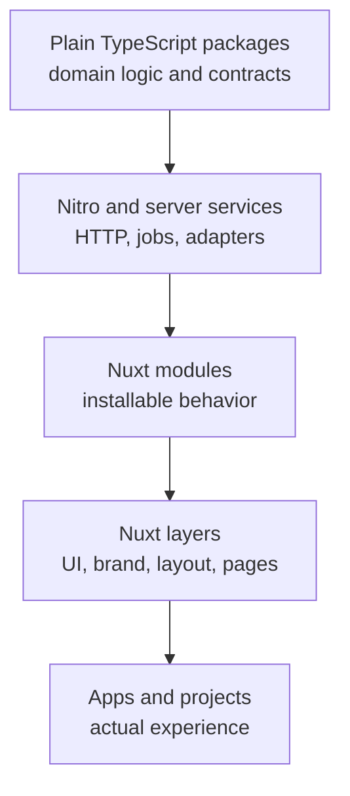

happydesigns uses layered architecture so product logic, runtime access, UI foundations, brand expression, and project composition do not collapse into one place.

## Purpose

This section is the decision layer for where code belongs. It should help a contributor decide whether a change belongs in a plain TypeScript package, Nitro runtime, Nuxt module, Nuxt layer, product app, identity layer, docs site, or future help center.

## Decision rule

Put stable reusable behavior as low as practical. Put project-specific composition as high as practical.

## Architecture owns

- Product and layer boundaries.
- Runtime placement rules.
- Reuse and extension strategy.
- Brand-neutral product-core policy.
- Practical placement examples.

## Architecture does not own

- Full product implementation references.
- Customer instructions.
- Temporary planning logs.
- Product-specific API contracts unless they affect ecosystem boundaries.

## Read next

- [Layered architecture](/en/architecture/layered-architecture)
- [Runtime placement](/en/architecture/runtime-placement)
- [Separation of concern](/en/architecture/separation-of-concern)
