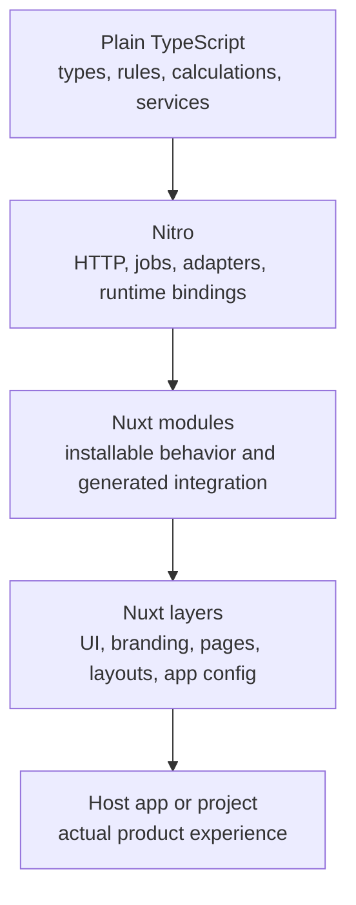
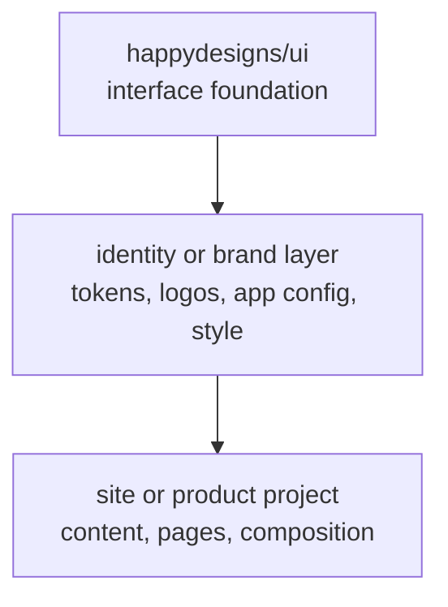
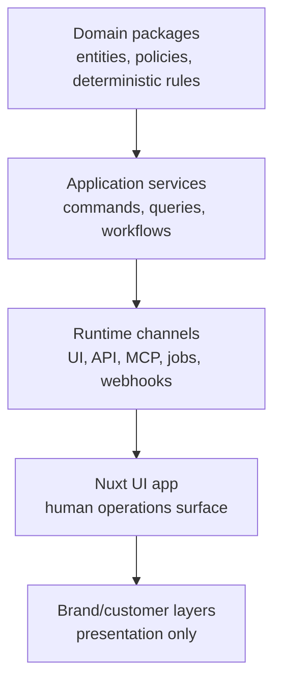

happydesigns separates reusable foundations, installable behavior, identity, and concrete project work.

## Purpose

Layering lets products share structure without sharing the wrong responsibilities. It also gives agents a reliable map before changing code.

## General model

## Website and docs model

`ui` provides reusable interface and content foundations. Identity and brand layers provide expression. The final project composes the actual site.

## Business OS model

Business behavior should live in shared command, query, and application-service layers that UI, HTTP APIs, scheduled jobs, webhook handlers, and MCP tools can reuse.

## Runtime rule

Use the lowest-level runtime that preserves product quality.

| Runtime | Use it for |
| --- | --- |
| Plain TypeScript | Deterministic logic, domain types, calculations, validation, parsing, formatting, service contracts, and reusable workflows. |
| Nitro | HTTP, request context, server plugins, jobs, deployment bindings, and runtime adapters. |
| Nuxt modules | Installing behavior into Nuxt apps. |
| Nuxt layers | UI, branding, pages, layouts, components, and app config. |
| Nuxt app code | The actual user experience. |

## Read next

- [Runtime placement](/en/architecture/runtime-placement)
- [Brand-neutral core](/en/architecture/brand-neutral-core)
