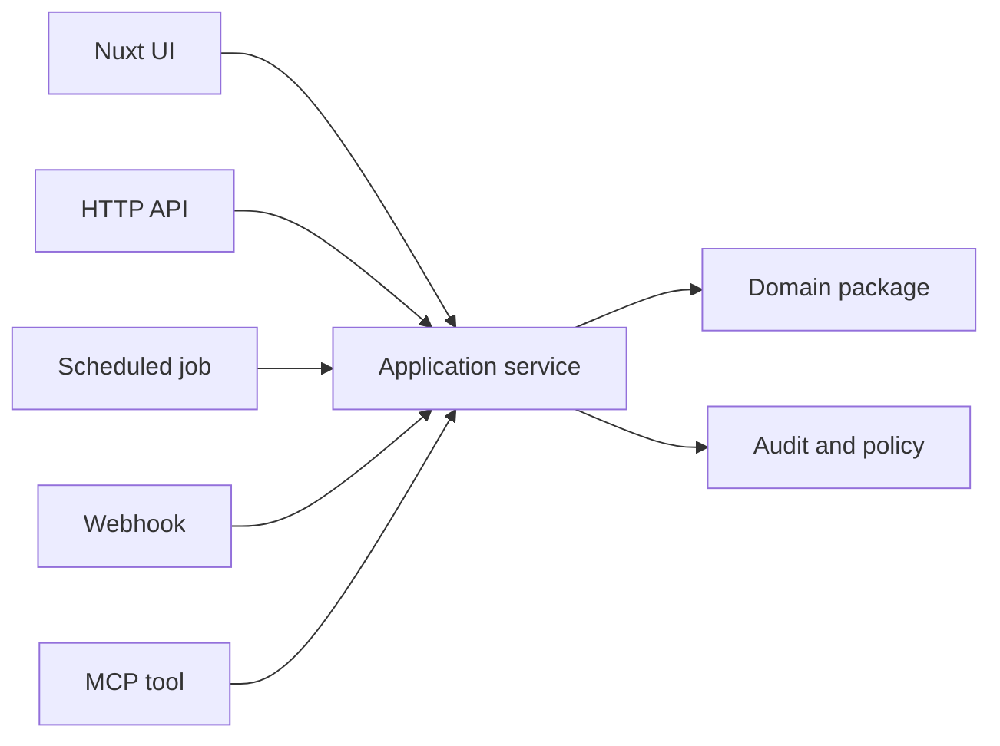

Runtime placement decides where a business action is implemented and which interfaces expose it. Here, an interface is any way a person, system, or agent uses the product: UI, API, webhook, scheduled job, MCP tool, or integration.

Use this page when a change could be written in several places. The goal is to keep the rule in one place and expose it through the right interfaces.

Put shared business rules below the interface that triggers them. Put request-specific code at the server route, job, webhook, or MCP tool. Put presentation in the Nuxt app or layer.

## Interface model

The diagram shows how interfaces converge. Each interface calls the same application service instead of reimplementing the action. The service applies policy and audit rules, then delegates business rules to a domain package.

## Placement table

Use this ownership table when choosing where a behavior belongs:

| Level | Owns |
| --- | --- |
| Plain TypeScript | Domain rules, validation, calculations, parsing, formatting, predictable workflows. |
| Application service | Commands, queries, policy checks, coordination, behavior shared by multiple channels. |
| Nitro | HTTP handlers, server plugins, deployment bindings, runtime adapters, scheduled jobs. |
| Nuxt module | Installation, hooks, generated files, runtime config, typed integration. |
| Nuxt layer | UI composition, layout, app config, content, brand and customer presentation. |
| Nuxt app | Concrete product experience and route-level composition. |

## Scenario examples

These scenarios show where the shared rule lives and which interfaces may expose it.

| Scenario | Place the behavior in | Expose it through |
| --- | --- | --- |
| Finalize an invoice. | Application service plus domain package. | UI action, HTTP API, scheduled job, webhook, and MCP tool as needed. |
| Validate a content variant definition. | Plain TypeScript package or Nuxt module contract. | Module setup, generated types, and app build checks. |
| Render a branded dashboard shell. | Nuxt layer and app config. | Nuxt app routes and layout composition. |
| Receive an n8n workflow callback. | Nitro route that calls an application service. | Webhook endpoint with shared policy and audit. |

## Anti-patterns

UI visibility is not authorization. Extension metadata is not permission enforcement. Demo API boundaries are not production authorization.
