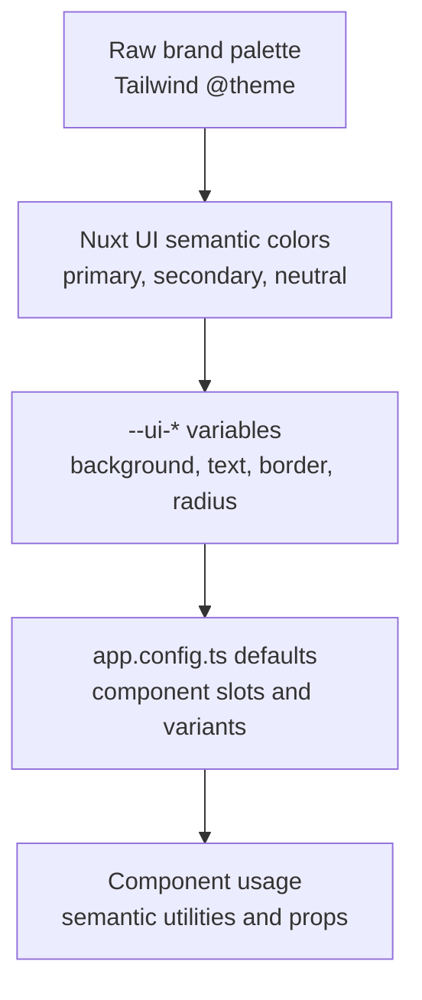

happydesigns uses Nuxt UI as the default UI system for app shells, navigation, buttons, forms, modals, tables, badges, tabs, dropdowns, command surfaces, toast states, and token-driven styling.

## Purpose

This policy prevents reusable components from scattering raw colors, dark-mode variants, and one-off styling decisions.

## Decision rule

Define the color system centrally. Components should consume semantic tokens.

## Component policy

- Define raw brand palettes centrally in the identity or brand layer using Tailwind v4 `@theme`.
- Map palettes to Nuxt UI semantic colors in `app.config.ts`.
- Override `--ui-*` CSS variables centrally for background, text, border, radius, and container behavior.
- Use semantic utilities such as `text-default`, `text-muted`, `text-highlighted`, `bg-default`, `bg-muted`, `bg-elevated`, `border-default`, and `border-muted`.
- Prefer Nuxt UI components before raw HTML for common app surfaces.
- Use `UTable` for row and column data instead of rebuilding tables with cards or grids.
- Read generated Nuxt UI theme files when customizing slots.
- Keep local `ui` overrides small and reusable.

## Avoid by default

- `text-gray-900 dark:text-gray-100`
- `bg-white dark:bg-gray-950`
- Raw palette choices in reusable application components.
- Rebuilding standard Nuxt UI surfaces from scratch.
- Local styling fixes that should be central token decisions.

## Raw palette classes are allowed

Inside identity layers, logos, controlled illustrations, brand canvas areas, and intentional art direction.

## Read next

- [Token system](/en/identity/token-system)
- [happydesigns brand](/en/identity/happydesigns-brand)
