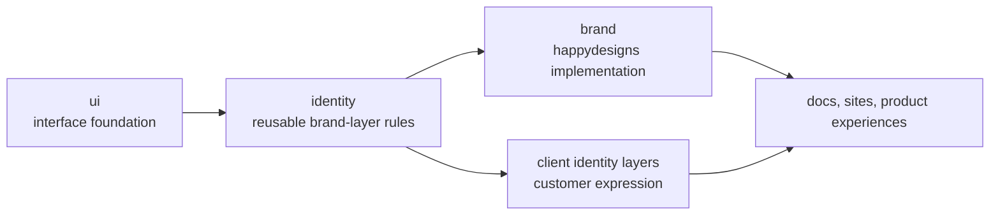

`happydesigns/identity` is the product direction for reusable identity and brand-layer rules.

These docs explain what identity means for the ecosystem. Dedicated identity docs carry the implementation material for building with `identity`.

Document strategy here. Document implementation in the dedicated identity product docs.

## Identity model

Read this model as a presentation stack. `ui` provides reusable interface foundations, `identity` defines reusable brand-layer rules, and happydesigns or client identity layers apply visual expression for projects. Product behavior stays below these layers.

## Scope

This ecosystem manual owns the cross-product identity boundary:

- The relationship between `ui`, `identity`, `brand`, and client identities.
- What brand layers may and may not own.
- The token hierarchy used across happydesigns.
- The role of `happydesigns/brand`.

The dedicated identity docs own implementation material:

- Package installation and usage.
- Token schema reference.
- Brand-layer scaffolding.
- Migration guides.
- Examples and templates.
- Versioned implementation reference.

## Boundary examples

Use the identity boundary when a change mixes visual expression with reusable product behavior.

| Change | Belongs in | Reason |
| --- | --- | --- |
| Define reusable token names and brand-layer structure. | `happydesigns/identity` docs and implementation. | The pattern works for happydesigns and client identities. |
| Map the happydesigns palette to Nuxt UI color roles. | `happydesigns/brand`. | The mapping is specific to the happydesigns brand. |
| Add a client logo, metadata, and footer links. | Client identity layer. | The change customizes presentation without changing product behavior. |
| Add tenant permissions or invoice numbering. | Product service or domain layer. | Brand and identity layers must not own product permissions or business rules. |

## Not the same as brand

`happydesigns/brand` is the happydesigns-specific implementation. `happydesigns/identity` is the broader product direction for creating reusable identity systems for happydesigns and clients.
