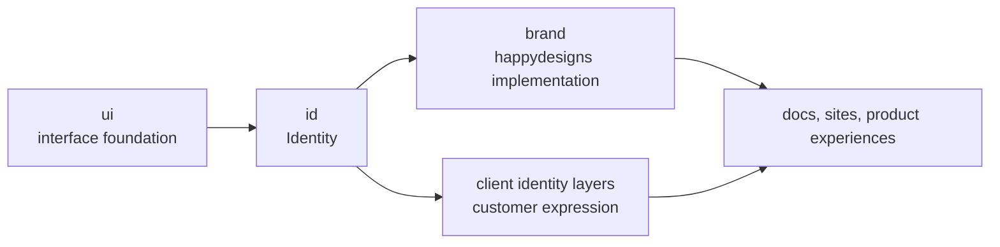

`id` defines reusable identity and brand-layer rules.

These docs explain what identity means for the ecosystem. Dedicated `id` docs cover package installation, APIs, examples, and version details.

Document ecosystem strategy here. Document implementation in the dedicated `id` docs.

## Identity model

Read this model as a presentation stack. `ui` provides reusable interface foundations, `id` defines reusable brand-layer rules, and happydesigns or client identity layers apply visual expression for projects. Product rules stay below these layers.

## Scope

This ecosystem manual owns the cross-product identity boundary:

- The relationship between `ui`, `id`, `brand`, and client identities.
- What brand layers may and may not own.
- The token hierarchy used across happydesigns.
- The role of `happydesigns/brand`.

The dedicated `id` docs cover:

- Package installation and usage.
- Token schema reference.
- Brand-layer scaffolding.
- Migration guides.
- Examples and templates.
- Versioned implementation reference.

## Boundary examples

Use this page when a change mixes brand presentation with product rules.

| Change | Belongs in | Reason |
| --- | --- | --- |
| Define reusable token names and brand-layer structure. | `happydesigns/id` docs and implementation. | The pattern works for happydesigns and client identities. |
| Map the happydesigns palette to Nuxt UI color roles. | `happydesigns/brand`. | The mapping is specific to the happydesigns brand. |
| Add a client logo, metadata, and footer links. | Client identity layer. | The change customizes presentation without changing what the product does. |
| Add permissions, workflow rules, or data changes. | Product service or domain layer. | Brand and identity layers change appearance, not product rules. |

## Not the same as brand

`happydesigns/brand` is the happydesigns-specific implementation. `happydesigns/id` defines reusable identity systems for happydesigns and clients.
