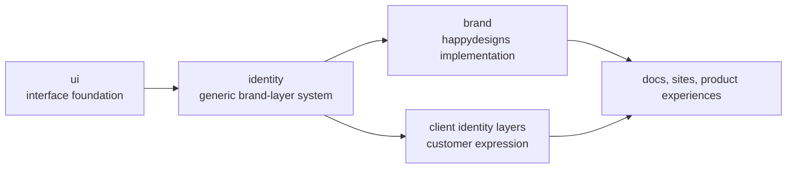

Identity is the strategy for applying brand expression on top of reusable product foundations without moving product behavior into brand layers.

This section explains the ecosystem-level boundary. The dedicated `happydesigns/identity` product docs own implementation guides, APIs, templates, token schemas, examples, migrations, and reference material.

`identity` is the generic system. `brand` is the concrete happydesigns brand layer.

## Scope

This section owns the identity strategy that affects more than one product:

- Identity and brand-layer boundaries.
- Relationship between `identity`, `brand`, `ui`, and clients.
- Token flow and Nuxt UI semantic policy.
- happydesigns brand usage rules.

It does not replace the dedicated identity product documentation:

- Full identity package APIs.
- Token schema reference docs.
- Brand asset downloads.
- Customer-specific brand manuals.
