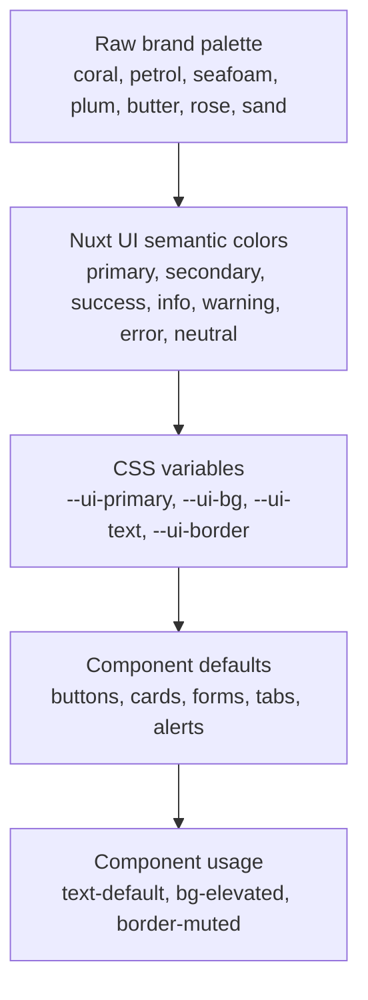

happydesigns styling should flow from central identity tokens into semantic component usage.

## Purpose

The token system keeps light/dark behavior, brand colors, and component styling centralized.

## Decision rule

Components consume semantic utilities. Identity layers define the palette and semantic mapping.



## Current brand example

```txt
coral, petrol, seafoam, plum, butter, rose, sand
  ->
primary, secondary, success, info, warning, error, neutral
  ->
--ui-primary, --ui-bg, --ui-text, --ui-border
  ->
Nuxt UI defaults and semantic utilities
```

## Component rule

Components should usually consume semantic utilities such as `text-default`, `bg-elevated`, and `border-muted`. They should not choose raw brand colors unless they are part of the identity layer, a logo, or a controlled brand canvas.

## Read next

- [Nuxt UI policy](/en/development/nuxt-ui-policy)
- [happydesigns brand](/en/identity/happydesigns-brand)
