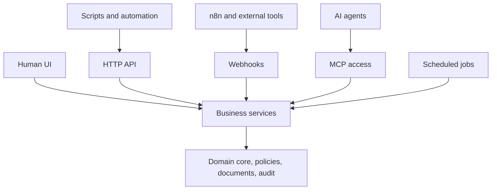

`os` is the product key for Business OS, an automation-first operating system for individuals, small businesses, clubs, and agent-powered companies. Business OS exposes the same work through UI, API, jobs, webhooks, and MCP.

## Runtime model

Human UI, scripts, external tools, agents, and scheduled jobs enter through different routes. Those routes call the same services, policies, document handling, and audit behavior.

## Product areas

Business OS includes these product areas:

- Organizations, users, memberships, and permissions.
- Companies, contacts, and projects.
- Tasks, work queues, and workflow history.
- Knowledge-base registry and documents.
- Agent roles and governance policies.
- Audit log, API foundations, webhook foundations, and MCP foundations.
