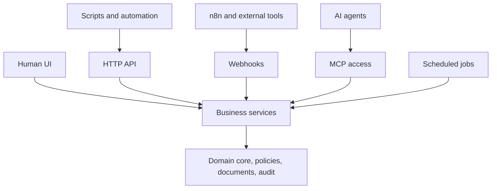

`happydesigns/business` is the private Business OS product. It uses `@happydesigns/business` as its package and repository identity.

Business OS is an automation-first operating system for individuals, small businesses, clubs, and agent-powered companies.

This page explains Business OS at the ecosystem level. It is not the full product documentation or domain model.

Business OS shares one command, query, and application-service layer across UI, API, jobs, webhooks, and MCP.

## Runtime model

Business OS channels converge before they reach domain behavior. Human UI, scripts, external tools, agents, and scheduled jobs can enter through different runtime surfaces, but they share services, policies, document handling, and audit behavior.

## Product areas

Organizations, users, memberships, permissions, knowledge-base registry, tasks, work queues, workflow history, agent roles, governance policies, documents, audit log, API foundations, webhook foundations, MCP foundations, companies, contacts, and projects.

## Boundary

Deep Business OS product docs belong in dedicated Business OS product documentation.
