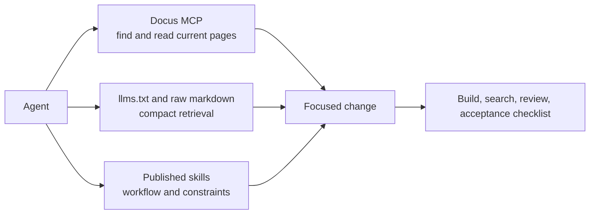

Agents should work from current documentation, product boundaries, and explicit acceptance checks instead of stale memory.

## Purpose

This section explains how AI tools should retrieve facts, activate workflows, and validate changes across happydesigns repositories.

## Decision rule

MCP answers what is true. LLM files expose readable content. Skills define how agents should act.

## This section owns

- MCP usage.
- LLM file expectations.
- Skill discovery and scope.
- Agent workflow.
- Acceptance checklist.
- Guardrails.

## This section does not own

- Generic AI prompting advice.
- Private task logs.
- Product-specific automation API references.

## Read next

- [MCP](/en/ai/mcp)
- [LLMs](/en/ai/llms)
- [Agent workflow](/en/ai/agent-workflow)
