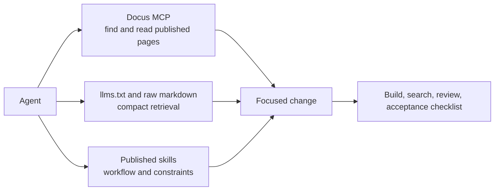

Agents should work from published documentation, product boundaries, and explicit acceptance checks instead of stale memory.

This section explains how AI tools should retrieve facts, activate workflows, and validate changes across happydesigns repositories.

MCP answers what is true. LLM files expose readable content. Skills define how agents should act.

## Agent workflow model

## Scope

This section owns the operating model for agent-assisted work:

- MCP usage.
- LLM file expectations.
- Skill discovery and scope.
- Agent workflow.
- Acceptance checklist.
- Guardrails.

It does not try to become a general AI manual:

- Generic AI prompting advice.
- Private task logs.
- Product-specific automation API references.
