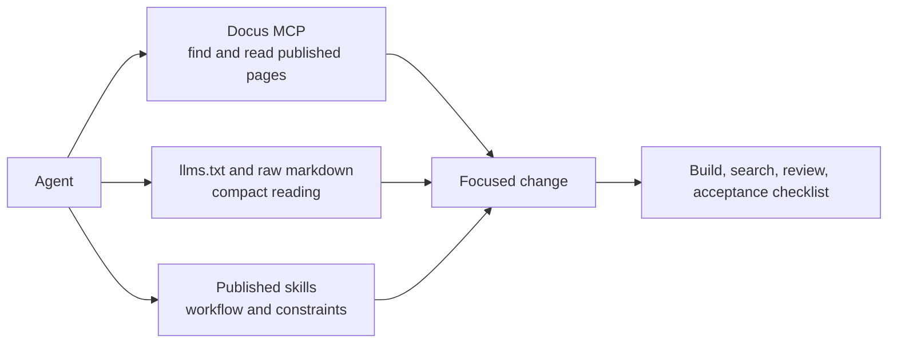

Agents follow a repeatable workflow before changing happydesigns code or docs.

The workflow reduces stale assumptions, misplaced changes, and documentation drift.

Inspect first. Read the published docs. Change the smallest coherent owner. Validate before finishing.

## Workflow model

The model separates reading, behavior, and validation. MCP and LLM files help agents read the docs, skills constrain how agents act, and the acceptance checklist decides whether the change is complete. None of these sources replaces the others.

## Workflow

1. Inspect the repo and identify which happydesigns product, layer, or project is being changed.
2. Read relevant docs through Docus MCP or local files.
3. Determine where the change belongs.
4. Reuse existing layers, modules, components, and config before creating new code.
5. Preserve separation of concern.
6. Implement minimal, focused changes.
7. Validate with available commands.
8. Do not introduce new architecture unless the docs justify it.
9. If unsure, ask for human review instead of guessing product direction.

## Documentation rule

Keep stable architecture in docs. Keep temporary task planning in `.agents/` or Business OS. Do not publish temporary task notes as documentation.
